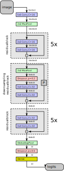

# Deep Neural Networks based on ODEs

JAX/Optax based implementation of ODE-based neural networks for trying out the ideas in [Haber and Ruthotto (2017)](https://arxiv.org/abs/1705.03341) and [Ruthotto and Haber (2020)](https://arxiv.org/abs/1804.04272).

## Resnet architecture
The following network is a simplified verion of the architecture described in [He et al. (2015)](https://arxiv.org/abs/1512.03385), adapted for smaller images of size $32\times 32$ considered here.


## Code structure
### Main notebook
To train the network and evaluate performance, run [TrainCNN.ipynb](src/TrainCNN.ipynb). The central `fit()` function defines the loss function and accuracy metric and updates the model weights by iterating over the training dataset. For this, it extracts shuffled and augmented batches of images and corresponding labels with `image_dataset_loader.get_shuffled_batched_train_data(batch_size)` and feeds these to the `step()` function, which returns the updated weights. At the end of each epoch, the loss and accuracy will also be computed for the validation data. Note that in `train_state = dict(rngkey=rngkey, train=True)` the `train` parameter is set to true to enable random dropout; for `valid_state = dict(rngkey=rngkey, train=False)` this parameter is set to `False`.

The training accuracy averaged over one epoch is given by

$$
A(n_B) = \frac{1}{n_{B}}\sum_{b=1}^{n_{B}} a_b
$$

where $n_{B} = \frac{\text{number of training samples}}{\text{batchsize}}$ is the number of training batches and $a_b$ is the accuracy of minibatch $b$. This sum is computed incrementally, using the fact that for any sum $S(n)$ over $n$ terms we have that

$$
S(n) = \frac{1}{n}\sum_{j=1}^{n} a_j = \frac{1}{n}((n-1)S(n-1)+a_n) = S(n-1) + \frac{a_n-S(n-1)}{n}
$$

The notebook [TrainCNN.ipynb](src/TrainCNN.ipynb) uses the following two Python modules:

### Image dataset loaders
The file [image_dataset_loader.py](src/deep_nn_odes/image_dataset_loader.py) contains classes for loading images from the MNIST and CIFAR10 datasets. The datasets are split into training, validation and test data. When creating new instances, the paths to the MNIST and CIFAR10 datasets have to be provided. Both classes are derived from the base class `ImageDatasetLoader` which provides the following functionality:

* `get_shuffled_batched_train_data()` returns two lists with the batched training images and corresponding training labels. Each entry in the first list is a tensor of shape $B\times n_x\times n_y\times C$ where $B$ is the minibatch size, $n_x\times n_y$ is the image size and $C$ is the number of channels (where $C=1$ for grayscale MNIST images and $C=3$ for the RGB CIFAR10 images). Each entry in the second list is a tensor of shape $B$, with each entry being an integer number in the set $\{0,1,\dots,M-1\}$ where $M$ is the number of categories (we have that $M=10$ for both MNIST and CIFAR10). The images in the training dataset are randomly shuffled in each epoch and the following data normalisation/augmentation is applied:
    - For each channel, the mean value (over the training set) is subtracted and the result is divided by the standard deviation.
    - Images are randomly flipped in the horizontal direction
    - images are padded by 4 pixels in each direction and sub-images of size $n_x\times n_y$ are cut out of the padded $(n_x+4)\times (n_y+4)$ image

* `get_validation_data()` returns two tensors of shape $n_{\text{valid}}\times n_x\times n_y \times C$ (images) and $n_{\text{valid}}$ (labels) with the validation data, where $n_{\text{valid}}$ is the number of images used for validation.

* `get_test_data()` returns two tensors of shape $n_{\text{test}}\times n_x\times n_y \times C$ (images) and $n_{\text{test}}$ (labels) with the validation data, where $n_{\text{test}}$ is the number of images used for testing.

It should not be necessary to understand the details of [image_dataset_loader.py](src/deep_nn_odes/image_dataset_loader.py), but it might be worth creating instances of `MNISTDatasetLoader` and `CIFAR10DatasetLoader` and play around with the above functions.


### ResNet
The ResNet shown in the diagram above is implemented in [cnn_model.py](src/deep_nn_odes/cnn_model.py). The code can be split into two types of functions:

* Functions starting with `init_` initialise the parameters and return a dictionary with the initial parameter values. `init_resnet_parameters()` is the main function, which in turn calls `init_downsampling_residualblock_parameters()` and `init_residualblock_parameters()` for initialising the parameters of the residual blocks and downsampling residual blocks shown in the diagram above.

* The function `resnet_model()`, which in turn calls `residual_block()` and `downsampling_residual_block()`, implements the ResNet model itself. The model architecture can be modified by editing this function (and the corresponding initialisation functions).

There is also the `dropout()` auxilliary function which provides a low-level implementation of dropout regularisation. The model state (which is simply a dictionary containining the `train` flag and a key for the random number generator) is required since the dropout layer depends on random numbers behaves differently, depending whether the model is used for training or evaluation:

* during training (`train=True`), a fraction of $p_{\text{dropout}}$ randomly chosen nodes is set to zero and the total output is scaled by $(1-p_{\text{dropout}})^{-1}$ to compensate for this.
* during evaluation (`train=False`) all nodes are kept, i.e. the dropout function just implements the identity.

## Usage
The notebook in [TrainCNN.ipynb](src/TrainCNN.ipynb) can be run after a local installation (see below) or by opening it directly in google colab. Make sure it runs in a GPU instance, otherwise training is too slow. The first cell of the notebook will mount google drive, where it installs the dependencies and the `deep_nn_odes` package itself. This will then make it possible to import the modules [image_dataset_loader.py](src/deep_nn_odes/image_dataset_loader.py) [cnn_model.py](src/deep_nn_odes/cnn_model.py)) in [TrainCNN.ipynb](src/TrainCNN.ipynb). It will also download the MNIST and CIFAR10 data to the correct directory on google drive.

## Local installation
To install locally, use
```
python -m pip install .
```

or, for an editable install,

```
python -m pip install --editable .
```